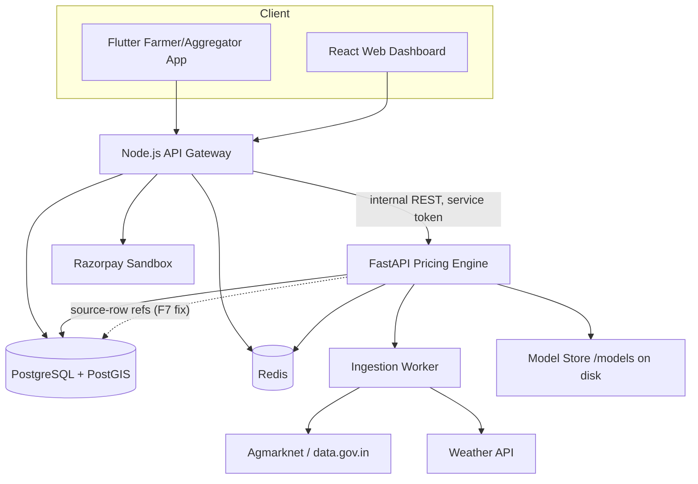

# AGRIDIRECT PRICING ENGINE V0.1
# FINAL ARCHITECTURAL & ML AUDIT

Auditor role: Principal Software Architect + Lead Data Scientist + ML Engineer + Data Engineer + SIH Technical Reviewer + Adversarial QA Auditor
Subject: `AgriDirect_Pricing_Engine_V0.1_Specification.md` (SIH26033)

---

## 1. Executive Verdict

### 🟡 READY AFTER CORRECTIONS

There is no single defect that makes the spec un-buildable, and the document is unusually disciplined for a hackathon spec — it self-flags most of its own assumptions (`ASSUMPTION`, `DEFER TO V0.2`, `NOT AVAILABLE/FUTURE`), separates training from inference, and has an internal consistency audit section already. That said, one issue sits at the center of the actual deliverable — the pricing formula — and is serious enough that implementing it as literally written will produce a methodologically unsound (and arithmetically unverifiable) "Fair Price." That must be resolved before Day 9 (price discovery). A second cluster of issues (external API field-name assumptions, demand cold-start, confidence-score edge cases) is likely to surface as real bugs during Days 3, 8–9, and is cheap to fix now versus expensive to debug live.

None of the findings require new infrastructure, new technologies, or scope expansion — every recommended fix either removes something or clarifies something already present.

---

## 2. Risk Summary

| Severity      | Count |
| ------------- | ----: |
| Critical      | 1 |
| High          | 3 |
| Medium        | 8 |
| Low           | 4 |
| Informational | 1 |
| **Total**     | **17** |

---

## 3. Findings

| ID | Severity | Area | Finding | Impact | Required Action |
|----|----------|------|---------|--------|------------------|
| F1 | **CRITICAL** | Price Discovery (§15, §7.3, §7.4, §7.5, §14) | Weather (`rainfall_anomaly`, `temp_anomaly`), demand (`order_count_7d`, `requested_qty_7d`, `demand_growth`), and `regional_price_differential` are all listed as **V0.1 REQUIRED model input features** feeding Prophet/sklearn (§7.3–7.5, §14). The Section 15 formula then adds `w_demand·DemandAdjustment`, `w_weather·WeatherAdjustment`, and `w_region·RegionalDifferential` **again**, on top of `w_forecast·(Forecast−Baseline)`. | The same real-world signal (e.g. a rainfall anomaly) can move the price twice: once because it shifted Prophet/ML's point forecast, and again as an independent additive nudge in the same direction. This is textbook double-counting and will produce systematically over-reactive price ranges — exactly the "hardcoded rule stacked on a learned model" anti-pattern the spec explicitly says it wants to avoid (§14). It also makes the weights (`w_forecast=0.5, w_demand=0.2, w_weather=0.15, w_region=0.15`) uninterpretable, since two of them partially duplicate what's already inside the 0.5 term. | Pick one mechanism per signal, not both (see §10 corrected formula below). |
| F2 | HIGH | Price Discovery / Worked Example (§15 vs §41) | The Section 41 worked example does not reproduce the Section 15 formula arithmetically. Plugging §41's own numbers into §15 (`20.16 + 0.5×1.04 + 0.2×0.04 + 0.15×(−0.01) + 0.15×0.005`) gives ≈20.69, not the stated ≈21.34. Multiple readings of "nudge" (fraction of baseline vs. raw percentage vs. already-weighted ₹ value) were tried; none reconcile. | The one worked, judge-facing numerical proof in the entire spec (§48 Q17, Q19) doesn't actually check out. If a judge re-derives it live, the demo's credibility on the exact dimension it's trying to prove ("transparent, auditable math") breaks. | Recompute §41 step 6 by hand against whatever formula is chosen per F1's fix, and keep the worked example as a literal unit-test fixture (it should be T11's input, not just prose). |
| F3 | HIGH | Ingestion Contract (§4) | Field names (`state`, `district`, `market`, `commodity`, `arrival_date`, `min_price`, `max_price`, `modal_price`) are asserted as if confirmed, but marked only as a blanket "ASSUMPTION" about which *dataset* is used, not about field naming. Real data.gov.in/NIC resource APIs frequently expose field names with URL/whitespace-encoding artifacts (e.g., literal `x0020` substrings for spaces) and field sets that drift between resource IDs and revisions. | If the actual field names differ even slightly from what `AgmarknetClient`/the Pydantic schema expects, every record fails validation on Day 3 and ingestion silently produces zero usable rows — the first and most schedule-critical integration point in the whole 14-day plan. | Before Day 3 starts: pull one live sample from the actual chosen resource ID and hand-verify field names against §4.2's mapping table. Mark this UNVERIFIED ASSUMPTION explicitly in the spec until done. |
| F4 | HIGH | Demand Index (§13) | `norm(x)` is defined as min-max normalization against the commodity's trailing 90-day history. AgriDirect is stated elsewhere (§37, §39) to have **no real transaction history yet**. For a brand-new platform/commodity, the trailing-90-day window will frequently have `max == min == 0`, making min-max normalization a divide-by-zero. | Section 13's formula will crash or silently return `NaN`/`Infinity` on the exact cold-start condition the product is guaranteed to be in for most of the prototype's life, unless synthetic demo data is loaded for every path exercised live. | Define explicit cold-start behavior: if `max == min` (including the all-zero case), `norm(x) = 0` (not division by zero), and the Demand Index should additionally be flagged `"dataSource": "insufficient_demand_history"` distinct from the price-side fallback hierarchy. |
| F5 | MEDIUM | Confidence Score (§22, §12) | `ModelAgreement = clamp(1 − |ProphetPred − MLPred| / ProphetPred, 0, 1)` is undefined whenever only the baseline is active — which §12 says is the expected outcome for low-data mandis (`<90 days` → "baseline only, ML training skipped entirely"). | No documented default for `ModelAgreement` in baseline-only mode. An AI coding agent implementing §22 verbatim will either crash on a missing comparison or invent an undocumented default, breaking the "no architectural guessing" goal (§43). | Specify explicitly: when only the baseline is served, `ModelAgreement` defaults to a fixed neutral value (e.g., 0.5) and this is disclosed in `fallbacksUsed`, not silently substituted. |
| F6 | MEDIUM | Volatility Cap (§28) | "Confidence caps at Medium regardless of other sub-scores" during `STRESSED` volatility has no numeric definition — Medium is `60–79` (§22), a range, not a value. | Ambiguous for implementation: does "cap" mean `min(computed_confidence, 79)`, or force a fixed value like 70? Two different behaviors, both defensible readings of the same sentence. | Specify the exact rule, e.g.: `confidence = min(computed_confidence, 79)`. |
| F7 | MEDIUM | Traceability (§3 vs §30) | Section 30 claims every prediction is traceable end-to-end "to the specific `MandiPrice`/`WeatherObservation` rows used," but the `pricing.price_recommendation` table (§3) has no `mandi_id` column and no source-row reference columns — only a free-form `explanation JSONB`. | The relational schema cannot actually answer "which MandiPrice rows drove this number" via SQL/joins; it can only be recovered by parsing JSON, which is weaker than what §30 and §48 Q16 imply to judges. | Either add a `mandi_id` FK (and, if feasible, a `source_price_ids UUID[]`/join table) to `price_recommendation`, or soften §30's traceability claim to "traceable via the explanation JSON," not "linking...rows." |
| F8 | MEDIUM | Roadmap (§42, §49) | data.gov.in API key registration/approval **lead time** is not scheduled anywhere. §49's R1 covers *runtime* Agmarknet failure, not *pre-Day-1* signup latency, which is a real, commonly multi-day process. | If the key isn't requested before Day 1, Day 3 ("ingestion working against real API") can slip through no fault of the implementation. | Add "request data.gov.in API key" as a Day 0 / pre-Day-1 action item, independent of and before Day 3's ingestion coding work. |
| F9 | MEDIUM | Buyer Affordability (§16) | "Affordability Score can only ever pull the displayed buyer price toward the lower end of the already-computed buyer range" is stated qualitatively with no formula for *how much* it pulls, or what happens at Affordability Score values between 0 and 100. | An implementing agent has no deterministic function to code; two agents would build two different (and differently defensible) interpolation rules. | Add an explicit formula, e.g. `DisplayedBuyerPrice = BuyerRange.Upper − (AffordabilityScore/100) × (BuyerRange.Upper − BuyerRange.Lower)`, with the existing hard floor (never below `BuyerRange.Lower`, never touches farmer payout) unchanged. |
| F10 | MEDIUM | Normalized Ratio Features (§7.1, §22) | `volatility_30d = std/mean`, `ModelAgreement` (F5), and other ratio-based normalizations have no spec-wide convention for zero/near-zero denominators. | Scattered, inconsistent epsilon-handling is a realistic source of NaN propagation into the confidence score or price spread during low-volatility (flat-price) periods, which is otherwise a *good* market condition, not an edge case to under-handle. | Add one stated convention (e.g., "any ratio feature with denominator < ₹0.01 defaults to 0, logged") applied uniformly, referenced from every formula that divides by a market-derived quantity. |
| F11 | MEDIUM | 14-Day Roadmap (§42) | Day 6 (Prophet + temporal validation) and Day 7 (sklearn model + T34–T36) are each budgeted as a single day with zero slack, immediately after Day 3–5 which themselves depend on a live external API integration that F3/F8 flag as at-risk. No buffer day exists anywhere in the 14-day plan. | For "zero existing implementation, limited ML knowledge, AI agent" (the audit's stated developer profile), a first-time Prophet+temporal-CV implementation reliably takes longer than one day when debugging against real (messy) mandi data rather than a clean fixture. | Either extend to 15–16 days, or explicitly designate Day 7 as a shared Prophet/sklearn buffer with sklearn allowed to slip into Day 8's morning without blocking Day 8's actual demand/weather task. |
| F12 | LOW | Weather Schema (§2 vs §3) | The narrative entity table describes `mandi_id (or grid ref)` as the weather-observation key, but the SQL DDL only has `mandi_id UUID NOT NULL REFERENCES core.mandi(id)` — no grid-ref alternative exists in the actual schema. | Minor internal inconsistency; not implementation-blocking since the DDL is authoritative, but confusing for anyone reading §2 first. | Remove "(or grid ref)" from §2, or add the alternative column if grid-based weather lookup is actually wanted later. |
| F13 | LOW | WeatherObservation forecast vintage (§3) | `UNIQUE(mandi_id, obs_date, is_forecast)` means a new forecast run for the same target date overwrites the previous one on upsert — there's no way to retain "what did we predict for Aug 30, issued on Aug 25 vs. Aug 29" for later forecast-accuracy analysis. | Not demo-blocking (only latest forecast is ever needed for serving), but forecloses any post-hoc "how good was our weather forecast" narrative for judges without extra work later. | Optional: add a `generated_at` column to the unique key if forecast-decay analysis is ever wanted; otherwise explicitly note this is an accepted V0.1 limitation. |
| F14 | LOW | Confidence Score naming (§22) | A single 0–100 number derived from 7 manually-set weights (not fit to outcomes) is presented with the same visual weight/precision as a statistical confidence interval. | Judges (§48 Q1–Q20 anticipates tough questions) may reasonably challenge "82% confidence" as implying more rigor than a hand-tuned weighted sum provides. | Low-cost mitigation: keep the number, but keep the component breakdown (already present in §23) prominent, and consider the audit-prompt's suggested framing "Prediction Reliability Score" in judge-facing copy only — no schema change needed. |
| F15 | LOW | Data duplication (§3) | `PredictionLog.response_json` and `PriceRecommendation`'s structured columns store substantially overlapping data. | Pure redundancy/storage cost, not a correctness risk — flagged for completeness only. | No action required for V0.1; consider making `PredictionLog` reference `PriceRecommendation.id` instead of duplicating the full response if storage becomes a concern post-V0.1. |
| F16 | MEDIUM | AI-Agent Implementability (§43 cross-cut) | F5, F6, F9, F10 are each a case of the spec describing *intent* correctly but leaving the exact function undefined — precisely the class of ambiguity §43's stage-execution prompt asks agents to "stop and ask about," which will interrupt the intended one-day-per-stage cadence if not resolved up front. | Every unresolved ambiguity here is a guaranteed mid-sprint pause for developer clarification, which is fine on Day 2 and costly on Day 9 (demo week). | Resolve F5/F6/F9/F10 in the spec text itself before Day 9 (price discovery/confidence) begins, per the corrected formulas in Section 10 below. |
| F17 | INFORMATIONAL | "Where did my ₹100 go?" (§39) | Already correctly labeled "Illustrative," already tracked as R8 in the risk register with a sensible mitigation (cite real sources if time allows). | None — this is the one judge-facing numeric claim in the spec that is already defended correctly. | No action; noted as a positive control example for how the rest of the spec should hedge unverified numbers. |

---

## 4. Critical Corrections

1. **(F1)** Resolve the double-counting in the Section 15 price-discovery formula before any Day 9 work begins. This is the one change that must happen before implementation of the core deliverable, because it affects the DB schema's `explanation` JSONB shape, the API response contract (§23, §40), and the worked example (§41) all at once — fixing it later means touching all three again.

---

## 5. High-Priority Corrections

1. **(F2)** Re-derive §41's step 6 by hand once F1's formula is finalized, and promote it to an actual pytest fixture (feeds T11), not just narrative prose.
2. **(F3)** Pull one live sample from the actual data.gov.in resource before Day 3 and diff it against §4.2's field-mapping table; update the table with real field names, not assumed ones.
3. **(F4)** Add an explicit cold-start rule to §13's `norm(x)` definition (`max == min` → `0`, not divide-by-zero) before Day 8.

---

## 6. V0.1 Scope Changes

No new scope is being proposed to be added. This audit found no missing-but-necessary feature; every gap is a specification-precision gap in something already in scope. Existing scope calls are all sound:

| Feature | Current Status | Recommendation | Reason |
|---|---|---|---|
| Weather/demand as Prophet/ML regressors | REQUIRED | **REQUIRED — keep** | Correct approach (learned, not hardcoded rules). |
| Weather/demand as separate additive nudges in §15 | REQUIRED (as written) | **REMOVE** (see §10 below; fold into forecast term only) | Duplicates the regressor signal (F1). |
| `regional_price_differential` as both a model feature (§7.4) and a separate §15 term | REQUIRED (as written) | **KEEP as model feature only; REMOVE as separate §15 term** | Same double-counting logic as demand/weather. |
| MSP-based pricing | REMOVE FROM V0.1 | **Confirmed REMOVE** | Legally sensitive, correctly scoped out already. |
| OSRM real routing | DEFER TO V0.2 | **Confirmed DEFER** | Straight-line×multiplier adequate for prototype scale/timeline. |
| Deep learning / RL pricing | REMOVE FROM V0.1 | **Confirmed REMOVE** | No data volume or explainability justification; correctly scoped out. |
| Forecast-vintage tracking for weather (F13) | Not present | **OPTIONAL, defer** | Not demo-blocking; only needed for post-hoc forecast-accuracy storytelling. |

---

## 7. Corrected Architecture

The architecture in §1.5 is sound (clear ownership boundaries, no circular dependencies, no frontend→FastAPI shortcut, training/inference separated). No structural change is recommended — only the traceability gap (F7) touches this diagram, adding an explicit reference edge from `PriceRecommendation` back to its source `MandiPrice`/`WeatherObservation` rows.



---

## 8. Corrected Data Flow

```text
External Data (Agmarknet, Weather API)
→ AgmarknetClient / WeatherClient (single adapter each, per §4/§4.1)
→ Pydantic Schema Validation  → invalid → quarantine table (never silently dropped)
→ Canonical Storage (core.mandi, core.commodity, pricing.mandi_price [₹/quintal])
→ Unit Conversion Boundary (single utility fn: quintal→kg, applied exactly once)
→ Data Quality Pipeline (§5: dedupe, outlier flag-not-delete, missing-value rules)
→ Feature Engineering (as_of_date-threaded, point-in-time only — §7)
→ Forecasting Models (Baseline always; Prophet + sklearn if ≥90d history — §8/§9)
→ Price Discovery (§15, corrected formula below — Forecast alone carries
   weather/demand/regional signal; no duplicate nudge terms)
→ Farmer Floor (§17, hard block if below floor)
→ Buyer Affordability (§16, display-only adjustment within already-computed range)
→ Logistics + Pooling + Spoilage (§18–20)
→ Confidence Score (§22, with cold-start/no-comparison defaults per F5)
→ Explanation Payload (§23)
→ FastAPI response (§25)
→ Node.js (auth, rate limit, circuit breaker, schema validation — §26)
→ Frontend render (§38)
```

---

## 9. Corrected ML Pipeline

Unchanged from §8–§12 in substance — this part of the spec is well-designed (walk-forward validation, per-(crop,mandi) model selection, explicit acceptance threshold, baseline as evaluation floor and universal fallback). The only pipeline-level change is where weather/demand/regional-differential signal is allowed to influence the final number:

```text
Baseline (§8, deterministic, always available)
Prophet (regressors: weather anomaly, demand index — §14/§7.5)         ─┐
sklearn HistGradientBoosting (same regressor set, multivariate)         ├─ eligible models
                                                                          ┘
Temporal validation (walk-forward, §10) → Acceptance threshold (§11)
→ Model selection per (crop, mandi) (§12)
→ Forecast = output of the selected model (already reflects weather/demand/region)
→ FairPrice = Baseline + w_forecast·(Forecast − Baseline)   [see §10 below]
```

No `DemandAdjustment`/`WeatherAdjustment`/`RegionalDifferential` term is applied a second time outside the model.

---

## 10. Corrected Mathematical Model

**Principle applied:** each signal enters the final price exactly once, through exactly one mechanism, with units tracked at every step.

**Canonical internal unit: ₹/kg.** All mandi-sourced data (₹/quintal) is converted at a single, explicit boundary — recommend a typed conversion, e.g. a `PriceQuintal` vs `PriceKg` wrapper or a single `to_kg(price_quintal: Decimal) -> Decimal: return price_quintal / 100` function that every downstream module imports rather than reimplements (this closes the risk the spec's own Internal Consistency Audit already flagged).

**Baseline (§8) — unchanged, already unit-consistent in ₹/kg once inputs are converted:**
```
Baseline(t) = 0.4·ModalPrice_kg(mandi, t-1)
            + 0.3·WeightedMovingAvg_kg(mandi, 7d)
            + 0.2·RegionalMedian_kg(state, commodity, t-1)
            + 0.1·SeasonalIndex(commodity, week_of_year)
```

**Price Discovery (§15) — corrected to remove double counting:**
```
FairPrice = Baseline + w_forecast · (Forecast − Baseline)

Range:
  Lower = FairPrice × (1 − spread(volatility, confidence))
  Upper = FairPrice × (1 + spread(volatility, confidence))
```
- `Forecast` is Prophet's or sklearn's point prediction, which already incorporates weather anomaly, demand index, and regional differential as learned regressors (§7.3–7.5, §14).
- `w_forecast` (still 0.5, or re-tuned) is now the *only* weight in this formula, controlling how much the engine trusts the model's deviation from the deterministic baseline. This is simpler, removes three now-redundant config weights (`w_demand`, `w_weather`, `w_region`), and is still fully explainable in one sentence — arguably *more* SIH-defensible than the original, since it removes an artifact a skeptical judge (§48) could correctly poke a hole in.
- The explanation payload's `drivers` array (§23) still lists weather/demand/regional contributions — but sourced from the model's *feature importances / signed regressor coefficients* for that prediction, not from a second independent formula term. This keeps §20's "Explainability" goal intact without the double-counting.
- If, instead, the team prefers explicit standalone nudges over model regressors (simpler to explain, less accurate): drop weather/demand/regional-differential from the Prophet/sklearn feature set entirely and keep the original additive-nudge formula. **Do not do both.** Recommend keeping regressors-in-model (current default) since §14 already argues, correctly, that a learned crop/mandi-specific relationship beats a hardcoded rule.

**Everything downstream (§16 affordability, §17 farmer floor, §18 logistics, §20 spoilage, §21 final formula) is unaffected by this change** — they all consume `FairPrice`/`Baseline` as already-computed ₹/kg values and remain internally consistent as written.

**Confidence Score (§22) — unchanged formula, two default rules added:**
```
ModelAgreement = 0.5 (neutral) when no ML/Prophet comparison exists (baseline-only mode) — logged in fallbacksUsed
During STRESSED volatility (§28): confidence = min(computed_confidence, 79)
```

---

## 11. Corrected Fallback Hierarchy

Unchanged from §6 — this is one of the strongest sections of the spec (explicit, ordered, every fallback emits a disclosed `fallback_level`/`confidence_penalty`/`data_age_days` object, never silent). One addition, mirroring the price-side discipline onto the demand side per F4:

```
Live local mandi (today/yesterday)
      ↓
Recent local mandi (≤7 days old)
      ↓
Nearby mandi (within radius, same commodity, recent)
      ↓
Regional/state aggregate (median across state, recent window)
      ↓
Historical commodity baseline (same mandi, same week-of-year, prior years)
      ↓
Global/default commodity baseline (config-seeded reference price)

[Demand Index, parallel track]
Trailing 90-day platform history exists and has variance
      ↓
Trailing 90-day history exists but max==min (flat/zero) → norm(x) = 0, not divide-by-zero
      ↓
No history at all for this commodity/region → Demand Index withheld,
   "dataSource": "insufficient_demand_history", excluded from FairPrice
   (equivalent to w_demand-style term being unavailable, not zero-forced)
```

---

## 12. Corrected API Contract

Section 25's endpoint table (methods, paths, request/response shapes, error codes, timeouts) is complete and internally consistent with §26 (Node contract) and §40 (JSON examples) — no structural changes required. Two additions:

| Method | Path | Change |
|---|---|---|
| POST | `/predict-price` | Response's `drivers[]` entries for weather/demand/region must now be sourced from model feature attribution (§10 fix), not a separate formula term — document this in the Pydantic response model's docstring so the Node contract validator (§26) and frontend (§38) don't assume two independent numeric channels. |
| GET | `/model/status` | Add `modelAgreementDefault: bool` field so the frontend/judge dashboard can distinguish "models genuinely agree" from "no comparison was possible, neutral default used" (closes F5's ambiguity at the API boundary too, not just internally). |

---

## 13. Corrected Testing Strategy

§31's 40 test cases are a strong baseline. Add the following, all traceable to findings above:

| ID | Scenario | Input | Expected | Pass/Fail criteria |
|---|---|---|---|---|
| T41 | Formula double-count regression | Fixed baseline/forecast/weather/demand inputs identical to a Prophet regressor set | FairPrice matches corrected §10 formula exactly, not the original additive-nudge formula | Exact match; guards against F1 reintroduction |
| T42 | Demand Index cold start | Trailing 90-day window all zero | `norm(x) = 0` returned, no exception, `dataSource` flag set | No NaN/exception; flag present |
| T43 | Confidence, baseline-only mode | No Prophet/ML models trained for a (crop, mandi) | `ModelAgreement = 0.5`, disclosed in `fallbacksUsed` | Exact default value; disclosure present |
| T44 | Volatility cap exact rule | STRESSED volatility with computed sub-score confidence of 91 | Returned confidence == 79 | Exact match to `min(x, 79)` rule |
| T45 | Section 41 worked example as fixture | Exact §41 input values | Every intermediate value (baseline, forecast blend, range, logistics, final split) matches the (corrected) worked example to the stated precision | Exact match; this promotes F2's finding into a permanent regression test |
| T46 | Zero-denominator ratio features | Flat 30-day price series (std=0) | `volatility_30d = 0`, no exception | No exception; matches F10's stated convention |

---

## 14. Corrected 10–14 Day Roadmap

Core structure of §42 is sound and dependency-ordered correctly (schema → ingestion → features → models → pricing → logistics → API → integration → frontend → hardening). Adjusted for F8 (pre-Day-1 key lead time) and F11 (Day 6/7 buffer):

| Day | Change from original §42 |
|---|---|
| Day 0 (new, pre-sprint) | Request data.gov.in API key; confirm chosen resource ID; pull one live sample and hand-verify §4.2's field mapping (F3, F8) — do this *before* Day 1 so it isn't discovered on the Day-3 critical path |
| 1–5 | Unchanged |
| 6 | Prophet + temporal validation — unchanged scope, but explicitly allowed to spill 2–3 hrs into Day 7 morning if real data is messier than fixtures (F11) |
| 7 | sklearn model — same allowance; if both Day 6 and Day 7 slip, compress Day 8's weather-signal wiring (lower-risk, mostly plumbing) rather than Day 9's pricing logic |
| 9 | Price discovery — implement the §10-corrected formula, not the original §15 formula; run T41/T45 before moving to Day 10 |
| 10–14 | Unchanged |

No day count increase is strictly required if Day 0 is added as a pre-sprint action rather than an extra sprint day; if the team wants a true buffer day, insert it after Day 7.

---

## 15. AI Coding Agent Readiness

### Score: 78 / 100 — minor ambiguity

Reasoning: the spec is unusually complete for a hackathon document — explicit schema, explicit formulas for the vast majority of components, explicit failure/fallback tables, and a reusable stage-execution prompt (§43) that correctly instructs agents not to improvise. The score is held below the 90s band specifically by the findings above that require a genuine architectural/mathematical decision an agent should *not* make unilaterally: the Section 15 double-counting (F1) is exactly the kind of thing §43 tells an agent to flag and stop on — and it should, since two equally plausible resolutions exist (regressors-in-model vs. explicit-nudges, not both) with materially different pricing behavior. F5, F6, F9, F10 are smaller versions of the same problem — well-intentioned qualitative descriptions ("pulls toward the lower end," "caps at Medium") that don't fully constrain an implementation. Once Section 10's corrections are folded into the spec text itself, this score would move into the 90–100 band, since nothing else in the document requires the agent to guess.

---

## 16. SIH Judge Readiness

### Score: 82 / 100

- **Technical credibility (strong):** explicit fallback hierarchy that never silently substitutes, farmer-floor as a hard constraint rather than a UX suggestion, separation of forecasting/price-discovery/logistics, and honest scope-limiting language throughout (§46, §14 limitations note) — this is exactly the posture that survives adversarial judge questioning (§48 is itself a well-anticipated Q&A set).
- **Innovation (solid, correctly framed):** §47 correctly avoids claiming novelty from "using AI/ML" and instead locates differentiation in system design (explainability, confidence-aware fallback, spatial pooling, farmer protection) — the right framing for a panel that has seen many "mandi price + ML" submissions.
- **Feasibility (good, with the F3/F8/F11 caveats above):** achievable in the stated window if Day 0 prep and the Day 6/7 buffer are taken seriously; the original zero-slack version was a real risk to the demo, not just to code quality.
- **Explainability (good, one weak point):** §23's driver decomposition is the right level of sophistication for V0.1 (explicitly rejecting SHAP/LIME as overkill is a defensible, judge-explainable call) — but until F1 is fixed, the "why is the price what it is" story has a real internal inconsistency a technically sharp judge could find by asking to see the arithmetic (§48 Q17/Q19), which is precisely the scenario F2 describes.
- **Demo value:** strong — live fallback triggers, live BLOCKED-recommendation trigger, live circuit-breaker kill-and-recover, and a "Where did my ₹100 go?" visual are all genuinely demo-able and already correctly labeled where synthetic (§37, §39).

Score would rise to ~90 once F1/F2 are corrected and the worked example in §41 is regenerated to match, since that removes the single point where the spec's central "transparent, auditable pricing" claim doesn't currently hold up to hand-verification.

---

# IMPLEMENTATION GATE

## Can implementation begin immediately?

### NO

### Exact blockers before Stage 0 / Day 1 can start safely:

1. **(F1, CRITICAL)** Decide and document which mechanism carries weather/demand/regional signal into `FairPrice` — model regressors only (recommended) or standalone additive nudges — and update Section 15 accordingly. This is a five-minute decision but must be made before Day 9's code is written, and ideally before Day 1 so downstream sections (§23 explanation schema, §40 API example) are written against the final formula the first time.
2. **(F2)** Regenerate Section 41's worked example against the corrected formula so it is arithmetically self-consistent, and freeze it as the T11/T45 test fixture.
3. **(F3)** Pull one live sample from the actual data.gov.in resource and verify §4.2's field-mapping table before Day 3 begins (does not block Day 1–2, but must happen before Day 3).

### Documents/files to freeze once the above are resolved (before Stage 0):

- `AgriDirect_Pricing_Engine_V0.1_Specification.md` — with Section 15, Section 22 (F5/F6 defaults), Section 41, and Section 4.2 updated per this audit
- This audit document, retained in-repo alongside the spec per §43's reusable stage-execution prompt (the AI agent should re-read both)
- `configs/pricing_weights.yaml` (or equivalent) reflecting the reduced weight set (`w_forecast` only, per §10) once F1 is resolved
